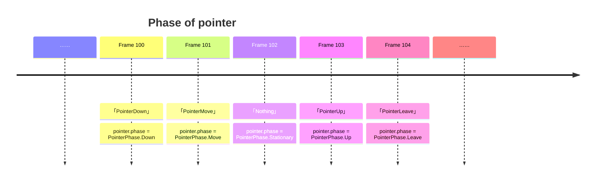
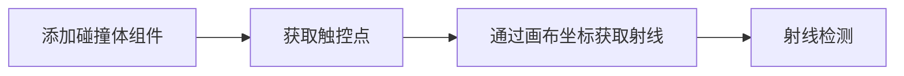

Galacean 的触控是基于 [Pointer](https://www.w3.org/TR/pointerevents3/) 实现的，它抹平了 [Mouse](https://developer.mozilla.org/zh-CN/docs/Web/API/MouseEvent) 与 [Touch](https://developer.mozilla.org/zh-CN/docs/Web/API/TouchEvent) 的差异，使得触控在概念和接口上都得到了统一。

## Pointer

在 Galacean 中，无论是 PC 上的鼠标，移动端的触控笔或是指头，当他在触控范围内发生对应行为时（ **Down**, **Move**, etc），都会被实例化为 [Pointer](/apis/core/#Pointer)，您可以在 [InputManager](/apis/core/#InputManager) 里获取到当前活动着的所有触控点。


> 需要注意的是，每个触控点都是相互独立的，它们响应对应的事件并回调相应的钩子函数。

### 生命周期

每个触控点都会在 **PointerDown** 或者 **PointerMove** 中开启自己的一生，在 **PointerLeave** 或者 **PointerCancel** 后黯然离场，在 Galacean 中，您可以通过 `Pointer.phase` 获取这个触控点的即时状态。



<playground src="input-log.ts"></playground>

### 触控按键

参照 [W3C 标准](https://www.w3.org/TR/uievents/#dom-mouseevent-button) 与[微软相关文档](https://learn.microsoft.com/en-us/dotnet/api/system.windows.input.mousebutton?view=windowsdesktop-6.0)，Galacean 对触控按键的定义如下：

| 枚举                                            | 解释                                                             |
| :---------------------------------------------- | :--------------------------------------------------------------- |
| [None](/apis/core/#PointerButton-None)           | 无触控按键按下                                                   |
| [Primary](/apis/core/#PointerButton-Primary)     | 设备的主按键，通常为左键（鼠标）或单按键设备上的唯一按键（指头） |
| [Secondary](/apis/core/#PointerButton-Secondary) | 设备的次级按键，通常为右键（鼠标）                               |
| [Auxiliary](/apis/core/#PointerButton-Auxiliary) | 设备的辅助按键，通常为滚轮（鼠标）                               |
| [XButton1](/apis/core/#PointerButton-XButton1)   | 设备的拓展按键，通常为撤销按键（鼠标）                           |
| [XButton2](/apis/core/#PointerButton-XButton2)   | 设备的拓展按键，通常为恢复按键（鼠标）                           |
| [XButton3](/apis/core/#PointerButton-XButton3)   | 拓展按键                                                         |
| [XButton4](/apis/core/#PointerButton-XButton4)   | 拓展按键                                                         |
| ……                                              | ……                                                               |

结合触控按键可以方便地检测触控点在本帧触发的行为：

<playground src="input-pointerButton.ts"></playground>

### 触控回调

只需要为添加了 Collider 组件的 Entity 增加触控回调，就可以实现与渲染物体交互的能力。触控回调已经整合到引擎的[脚本生命周期](/docs/script/class/#脚本生命周期)中，用户可以很方便地添加以下事件，同时钩子函数中会携带触发此回调的 Pointer 实例。

| 接口                                               | 触发时机与频率                                                             |
| :------------------------------------------------- | :------------------------------------------------------------------------- |
| [onPointerEnter](/apis/core/#Script-onPointerEnter) | 当触控点进入 Entity 的碰撞范围时触发一次                                 |
| [onPointerExit](/apis/core/#Script-onPointerExit)   | 当触控点离开 Entity 的碰撞范围时触发一次                                 |
| [onPointerDown](/apis/core/#Script-onPointerDown)   | 当触控点在 Entity 的碰撞范围内按下时触发一次                             |
| [onPointerUp](/apis/core/#Script-onPointerUp)       | 当触控点在 Entity 的碰撞范围内松开时触发一次                             |
| [onPointerClick](/apis/core/#Script-onPointerClick) | 当触控点在 Entity 的碰撞范围内按下并松开，在松开时触发一次               |
| [onPointerBeginDrag](/apis/core/#Script-onPointerBeginDrag)   | 当触控点在 Entity 的碰撞范围内按下时触发，表示开始拖动 |
| [onPointerDrag](/apis/core/#Script-onPointerDrag)   | 开始拖动后，触控点发生移动时触发 |
| [onPointerEndDrag](/apis/core/#Script-onPointerEndDrag)   | 开始拖动后，触控点松开时触发 |
| [onPointerDrop](/apis/core/#Script-onPointerDrop)   | 开始拖动后，当触控点在某个 Entity 的碰撞范围内松开时触发 |

> ⚠️ 触控回调**依赖物理引擎**，使用此功能前请确保物理引擎已初始化完毕。

如下示例：

- 最左边的立方体添加了对 Enter 与 Exit 的响应，当鼠标移动到上方和鼠标移出时便会触发它颜色的改变。
- 中间的立方体添加了对 Drag 的响应，你可以用鼠标拖拽这个立方体在空间内任意移动。
- 最右边的立方体添加了对 Click 的响应（先 down 后 up ），当鼠标点击时会触发它颜色的改变。

<playground src="input-pointer.ts"></playground>

### 射线检测

触控回调是基于射线检测实现的，若要自定义射线检测也十分简单，只需按照如下步骤即可。



添加碰撞体组件可参考[碰撞体组件](/docs/physics/collider/)，实现检测部分的代码逻辑如下：

```typescript
// 假设当前有一个活动的触控点
const pointer = inputManager.pointers[0];
// 通过触控点得到由相机发射的射线
const ray = camera.screenPointToRay(pointer.position, new Ray());
// 射线与场景的碰撞体进行碰撞检测
const hitResult = new HitResult();
if (scene.physics.raycast(ray, 100, hitResult)) {
  console.log("Hit entity", hitResult.entity);
}
```

通过下方示例可以更直观地理解此过程，示例中为主相机添加了辅助线，侧视相机可以完整观察到主相机射线检测到碰撞体的过程。

<playground src="input-pointerRaycast.ts"></playground>

## 兼容性

截止 2024 年 2 月，不同平台对 PointerEvent 的兼容性已经达到了 [96.35%](https://caniuse.com/?search=PointerEvent) 。

设计思路可参考：https://github.com/galacean/engine/wiki/Input-system-design.

> ⚠️ 若遇到平台的兼容性问题，可以在 https://github.com/galacean/polyfill-pointer-event 提 issue 。

## QA

### 触控在 PC 端正常，但在移动端异常

在移动端，触控会触发 HTML 元素的默认行为，一旦触发默认行为，触控就会从元素上被移除（PointerCancel），可以通过设置监听源的 `touchAction` 解决，若触控的监听源为默认画布：

```typescript
(engine.canvas._webCanvas as HTMLCanvasElement).style.touchAction = "none";
```

### 右键操作失效，弹出菜单栏

这是由于右键触发系统默行为导致的，可以加入下列代码阻止：

```typescript
document.oncontextmenu = (e) => {
  e.preventDefault();
};
```
