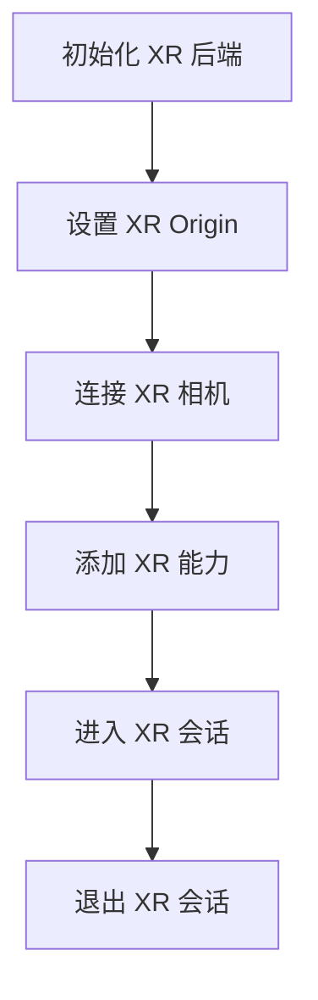

XR 管理器从属于 Engine 实例，你可以通过 `engine.xrManager` 获取。它在 XR 中扮演着总控制器的角色，主要管理：

- 串联 XR 的整体流程
- [XR 相机](/docs/xr-camera)
- [XR 会话](/docs/xr-session)
- [XR 交互](/docs/xr-input)
- [XR 功能](/docs/xr-features)

## 属性

| 属性   | 类型                        | 解释                                        |
| :----- | :-------------------------- | :------------------------------------------ |
| origin | [Entity](/apis/core/#Entity) | XR 初始化时的原点，它连接虚拟世界与现实世界 |

> 若你在编辑器中，将 origin 节点放置在 `（1，1，1）` 这个位置，那么可以理解为，当 XR 空间展开时，你在现实世界里坐标的参考原点是 `（1，1，1）` ，他们建立连接的方式是彼此之间有固定的转换公式。

## 方法

| 方法               | 解释             |
| :----------------- | :--------------- |
| isSupportedFeature | 是否支持某个功能 |
| addFeature         | 添加特定 XR 功能 |
| getFeature         | 获取特定 XR 功能 |
| getFeatures        | 获取所有 XR 功能 |
| enterXR            | 进入 XR 会话     |
| exitXR             | 退出 XR 会话     |

## 整体流程

依据上方的属性与方法，梳理一下 XR 的整体流程：

