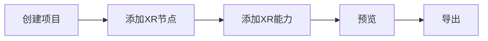

本篇文档讲分别讲述在编辑器和 ProCode 情况下如何快速开发 XR 互动。

## 编辑器

编辑器开发 XR 互动的流程如下所示：



### 创建项目

在 **[首页](/docs/interface/intro/#%E9%A6%96%E9%A1%B5)** 点击 **创建项目** ，随后在 **[项目设置](/docs/interface/menu/#项目设置)** 中选择物理后端为 `WebXR`


### 添加 XR 节点

在 **[层级面板](/docs/interface/hierarchy/)** 添加 XR 节点


> 添加 XR 节点会自动创建并选择 `origin` 和 `camera`，因此场景内不应该存在其他 `Camera` 组件，除非是有意为之。

> 场景内允许添加多个 XR 节点，但在同一时刻，有且只有一个 XR 节点生效。

### 预览

若已按照 [调试 XR 项目](/docs/xr/quickStart/debug/) 的要求使用 Chrome 与 [Immersive Web Emulator](https://chromewebstore.google.com/detail/immersive-web-emulator/cgffilbpcibhmcfbgggfhfolhkfbhmik) 插件，此时便可以直接预览。


### XR 能力

为了实现炫酷的虚实融合效果，通常会为 XR 互动添加一些其他能力。

#### 锚点追踪

在任意激活的 Entity 上添加 `XR Anchor Manage` 组件，即可为 XR 添加锚点追踪的能力。

| 属性        | 释义                                                                       |
| :---------- | :------------------------------------------------------------------------- |
| Anchor List | 追踪的锚点列表，用 Position 和 RotationQuaternion 确定现实空间中的锚点位姿 |
| Prefab      | 若设置预置体，锚点被追踪到时，该预置体会被实例化并挂载到追踪到的锚点上     |


#### 图片追踪

在任意激活的 Entity 上添加 `XR Image Manage` 组件，即可为 XR 添图片追踪的能力。

| 属性       | 释义                                                                   |
| :--------- | :--------------------------------------------------------------------- |
| Image List | 追踪的图片列表，添加 `ReferenceImageAssets` 来确定追踪的图片信息       |
| Prefab     | 若设置预置体，锚点被追踪到时，该预置体会被实例化并挂载到追踪到的锚点上 |


其中，追踪的图片在编辑器中是一种资产，您可以通过在 **[资产面板](/docs/assets/interface/)** 空白处依次 **右键** → **Upload** → **XRReferenceImage** → **选中对应图片** 即可上传追踪图片。

| 属性   | 释义                                                                   |
| :----- | :--------------------------------------------------------------------- |
| name   | 追踪图片的名称（唯一），可以根据此名称知晓被追踪到的图片               |
| Prefab | 若设置预置体，图片被追踪到时，该预置体会被实例化并挂载到追踪到的图片上 |

> 图片追踪无法在编辑器侧进行调试，需导出构建后用手机预览并调试。

#### 平面追踪

在任意激活的 Entity 上添加 `XR Plane Manage` 组件，即可为 XR 添加平面追踪的能力。

| 属性 | 释义 |
| :-- | :-- |
| Detection Mode | 识别平面类型，包含 `None` 、 `Horizontal` 、`Vertical` 、`EveryThing`,可以决定追踪的平面类型，默认选择 `EveryThing` ，但在 `WebXR` 中通常识别到的是水平平面 |
| Prefab | 若设置预置体，平面被追踪到时，该预置体会被实例化并挂载到追踪到的平面上 |


### 注意

需要注意的是，`WebXR` 规定必须在页面上通过按钮的点击才可进入 XR 上下文，若为 XR 项目，编辑器在预览时会自动为项目自动添加按钮来协助开发者预览。但项目导出后此步骤需要开发者自行添加，只需在 `Button` 的 `onClick` 回调中添加下方代码即可：

```typescript
// XR 管理器
const xrManager = engine.xrManager;
// 开启的 XR 会话模式
const xrMode = XRSessionMode.AR;
engine.xrManager.sessionManager.isSupportedMode(xrMode).then(
  () => {
    // 点击进入 XR 会话
    htmlButton.onclick = () => {
      xrManager.enterXR(xrMode);
    };
  },
  (error) => {
    // 不支持该模式
    console.error(error);
  }
);
```

## 脚本开发

在进入纯代码开发前，请先了解部分 [XR 管理器](/docs/xr/system/manager/) 内容，下方为开启 AR 互动的一个最简示例：

<playground src="xr-ar-simple.ts"></playground>