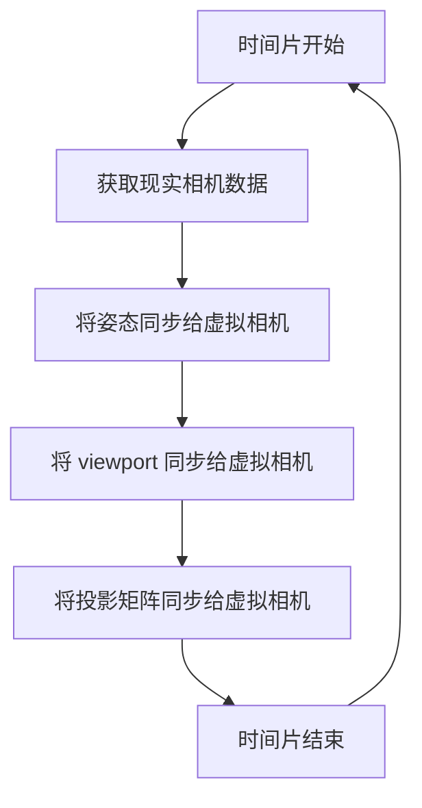

相机管理器从属于 XRManager 实例，你可以通过 `xrManager.cameraManager` 获取。

## 属性

| 属性 | 类型 | 解释 |
| :-- | :-- | :-- |
| fixedFoveation | number | 设置相机的固定视觉焦点，详情可参考[fixedFoveation](https://developer.mozilla.org/en-US/docs/Web/API/XRProjectionLayer/fixedFoveation) |

## 方法

| 方法         | 解释                                         |
| :----------- | :------------------------------------------- |
| attachCamera | 将虚拟世界的摄像头与现实世界的摄像头绑定     |
| detachCamera | 解除虚拟世界的摄像头与现实世界的摄像头的绑定 |

> 当 XR 会话类型为 AR 时，需要绑定的相机类型为 `XRTrackedInputDevice.Camera`

> 当 XR 会话类型为 VR 时，需要绑定的相机类型为 `XRTrackedInputDevice.LeftCamera` 和 `XRTrackedInputDevice.RightCamera`

## 更新流程

只需将`现实相机`的参数和姿态完全同步给`虚拟相机`，`现实场景`和`虚拟场景`就可以保持**同步**。

