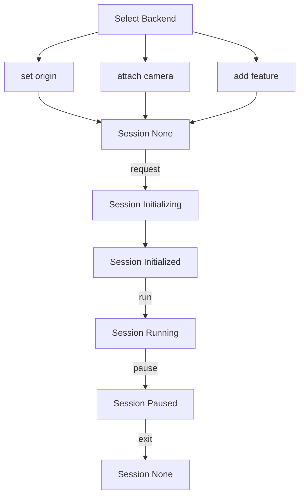

XR 管理器从属于 Engine 实例，你可以通过 `engine.xrManager` 获取。它在 XR 中扮演着总控制器的角色，主要管理：

- 串联 XR 的整体流程
- [XR 会话](/docs/xr/system/session/)
- [XR 交互](/docs/xr/system/input/)
- [XR 相机](/docs/xr/system/camera/)
- [XR 功能](/docs/xr/system/features/)

## 属性

| 属性 | 类型 | 解释 |
| :-- | :-- | :-- |
| sessionManager | [XRSessionManager](/docs/xr/system/session/) | 会话管理器，管理 XR 会话的生命周期和上下文，通过它可以监听会话的状态变化 |
| inputManager | [XRInputManager](/docs/xr/system/input/) | 交互管理器，管理 XR 空间中的所有输入，包含手柄，头显，相机等设备，通过它可以获取所有设备信息 |
| cameraManager | [XRCameraManager](/docs/xr/system/camera/) | 相机管理器，管理 XR 空间中的头显和相机，负责连接虚拟相机和现实相机 |
| features | [XRFeature](/docs/xr/system/features/) | XR 开启的所有能力 |
| origin | [Entity](/apis/core/#Entity) | XR 初始化时的原点，它连接虚拟世界与现实世界 |

> 若将 origin 节点放置在**场景**的 `（1，1，1）` 位置，那么当 XR 空间开启时，若追踪到的相机的位置为 `（x，y，z）` ，那么实际上相机在场景的世界坐标为 `（1 + x，1 + y，1 + z）` ，他们之间的转换即 origin 局部坐标至世界坐标的转换。

## 方法

| 方法 | 解释 |
| :-- | :-- |
| isSupportedFeature | 是否支持某个功能，开发者可以在使用前判断当前环境是否支持某功能 |
| addFeature | 添加特定 XR 功能，类似为节点添加组件 |
| getFeature | 获取特定 XR 功能，类似从节点获取组件 |
| enterXR | 进入 XR 会话，可以选择进入的 XR 会话类型（目前支持 `AR` 或 `VR`）, 若没有明确声明 `autoRun` 参数，在进入会话后会自动运行 XR 逻辑 |
| exitXR | 退出 XR 会话，所有的 XR 逻辑将被停止，上个会话添加的能力将被销毁，配置亦不会被保存， |

## 整体流程

依据上方的属性与方法，梳理一下 XR 的整体流程：

<playground src="xr-ar-simple.ts"></playground>
