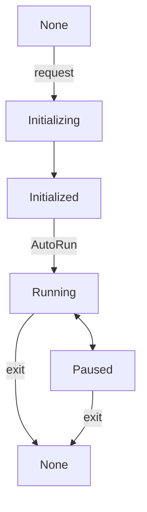

会话管理器从属于 XRManager 实例，你可以通过 `xrManager.sessionManager` 获取。

## 属性

| 属性               | 类型           | 解释                     |
| :----------------- | :------------- | :----------------------- |
| mode               | XRSessionMode  | (只读)获取当前会话类型   |
| state              | XRSessionState | (只读)获取当前会话状态   |
| supportedFrameRate | Float32Array   | (只读)获取硬件支持的帧率 |
| frameRate          | number         | (只读)获取硬件运行的帧率 |

## 方法

| 方法                       | 解释                                                                                    |
| :------------------------- | :-------------------------------------------------------------------------------------- |
| isSupportedMode            | 获取是否支持会话类型，开发者可以在开启会话前判断当前环境是否支持，入参为 `AR` 或者 `VR` |
| addStateChangedListener    | 添加对会话状态改变的监听，当状态改变时，回调将被执行并且最新的会话状态将被作为入参      |
| removeStateChangedListener | 移除对会话状态改变的监听                                                                |
| run                        | 运行会话                                                                                |
| stop                       | 停止会话                                                                                |

> XR 会话共有五种状态 `None` 、 `Initializing` 、 `Initialized` 、 `Running` 、 `Paused` ，各个状态之间的转换关系如下图，在进入 XR 会话后，开发者可以随时运行或停止会话，并且这个状态不影响引擎的 `run` 和 `pause` 。

