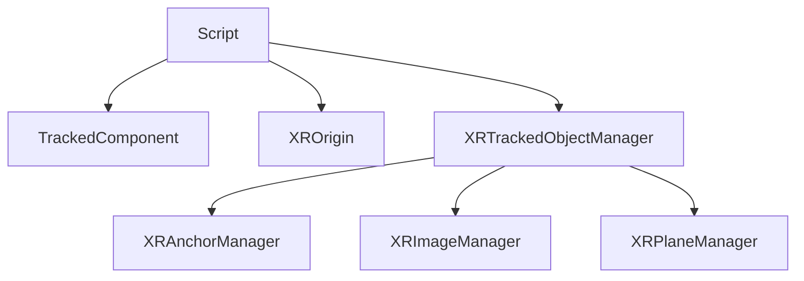

为了方便开发者快速[开发 XR 项目]()，Galacean 提供了 [@galacean/engine-toolkit-xr]() 高级组件 ，本文将详细讲述高级组件的属性与接口。

| 类型 | 类 | 释义 |
| :-- | :-- | :-- |
| 组件 | TrackedComponent | 当目标物被追踪时，会在追踪到的预制体或模型上挂载此组件，可以利用 `XRAnchorManager.getTrackedComponentByTrackId` 函数根据 ID 获取 |
|  | XROrigin | 可以在任意激活节点添加的组件，指定了 XR 空间的 `origin` 与 `camera`, **同一时刻至多生效一个** |
| 管理器 | XRAnchorManager | 可以在任意激活节点添加的组件，开启锚点追踪功能，并可配置追踪的锚点和追踪结果附加的预制体或模型， **同一时刻至多生效一个** |
|  | XRImageManager | 可以在任意激活节点添加的组件，开启图片追踪功能，并可配置追踪的图片和追踪结果附加的预制体或模型， **同一时刻至多生效一个** |
|  | XRPlaneManager | 可以在任意激活节点添加的组件，开启平面追踪功能，并可配置平面识别类型和追踪结果附加的预制体或模型， **同一时刻至多生效一个** |

## 继承关系



> 本质上都是基于脚本实现的高级功能，实际上是对 [@galacean/engine-xr]() 核心操作的高级封装。

## XROrigin

| 属性 | 类 | 释义 |
| :-- | :-- | :-- |
| mode | XRSessionMode | XR 会话模式，若为 `AR` 只需指定 `XRTrackedInputDevice.Camera`, 若为 `VR` 则需指定 `XRTrackedInputDevice.LeftCamera` 与 `XRTrackedInputDevice.RightCamera` |
| origin | Entity | 指定 `XRManager.origin` |
| camera | Entity | 将虚拟相机与设备相机相连接，通常为 AR 设备的相机 |
| leftCamera | Entity | 将虚拟相机与设备相机相连接，通常为头显设备的左眼 |
| rightCamera | Entity | 将虚拟相机与设备相机相连接，通常为头显设备的右眼 |

## TrackedComponent

| 属性               | 类        | 释义                                             |
| :----------------- | :-------- | :----------------------------------------------- |
| data               | XRTracked | XR 追踪结果数据，包含追踪的 ID，位姿与状态等信息 |
| destroyedOnRemoval | boolean   | 在追踪丢失后是否移除节点，通常为 `true`          |

## XRTrackedObjectManager

| 属性   | 类      | 释义                                    |
| :----- | :------ | :-------------------------------------- |
| prefab | boolean | 在追踪丢失后是否移除节点，通常为 `true` |

| 方法                         | 释义                                           |
| :--------------------------- | :--------------------------------------------- |
| getTrackedComponentByTrackId | 可以通过唯一的追踪 ID 获取被追踪物体装载的组件 |

## XRAnchorManager

| 属性    | 类       | 释义               |
| :------ | :------- | :----------------- |
| anchors | 锚点数组 | 指定追踪的锚点位姿 |

## XRImageManager

| 属性           | 类                    | 释义           |
| :------------- | :-------------------- | :------------- |
| trackingImages | XRReferenceImage 数组 | 指定追踪的图片 |

## XRPlaneManager

| 属性          | 类          | 释义               |
| :------------ | :---------- | :----------------- |
| detectionMode | XRPlaneMode | 指定追踪的平面类型 |

下方展示如何

```typescript
const scene = sceneManager.scenes[0];
const origin = scene.addRootEntity("origin");
const camera = origin.createChild("camera");
camera.addComponent(Camera);
const xrOrigin = origin.addComponent(XROrigin);

// 设置模式，origin 与 camera
xrOrigin.mode = XRSessionMode.AR;
xrOrigin.origin = origin;
xrOrigin.camera = camera;

// 添加平面识别高级管理器并配置识别的平面类型
const xrPlaneManager = origin.addComponent(XRPlaneManager);
xrPlaneManager.detectionMode = XRPlaneMode.EveryThing;

// 当追踪到平面时，通过 id 获取组件
xrManager
  .getFeature(XRPlaneTracking)
  .addChangedListener(
    (added: readonly XRTrackedPlane[], updated: readonly XRTrackedPlane[], removed: readonly XRTrackedPlane[]) => {
      added.forEach((plane) => {
        console.log("component", xrPlaneManager.getTrackedComponentByTrackId(plane.id));
      });
    }
  );
```
