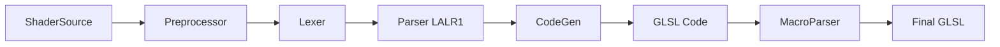
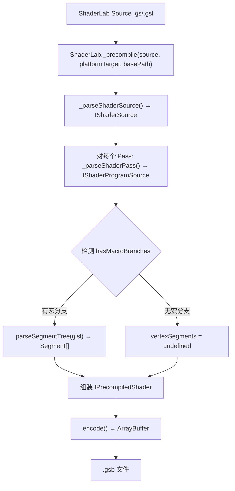
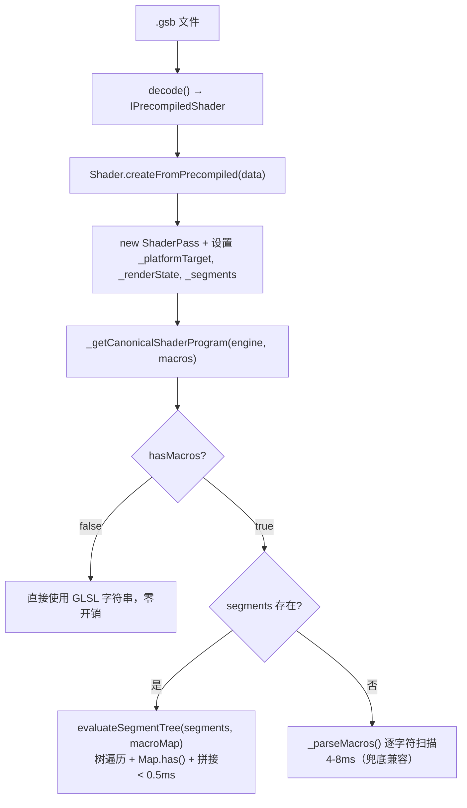

# ShaderLab 预编译优化 RFC

## 1. 背景与问题分析

### 1.1 编译流程

ShaderLab 编译系统采用多阶段流水线设计：



各阶段职责：

| 阶段         | 职责                                   | 时机   |
| ------------ | -------------------------------------- | ------ |
| Preprocessor | 展开 `#include`，收集 `#define`        | 构建时 |
| Lexer        | 词法分析，生成 tokens                  | 构建时 |
| Parser       | LALR(1) 语法分析，构建 AST             | 构建时 |
| CodeGen      | 遍历 AST，生成 GLSL 代码（保留宏分支） | 构建时 |
| MacroParser  | 运行时根据宏选择代码分支               | 运行时 |

**关键区分：两套独立的宏系统**

| 宏系统   | 处理器            | 时机                              | 来源                                |
| -------- | ----------------- | --------------------------------- | ----------------------------------- |
| 构建时宏 | `Preprocessor.ts` | `_parseShaderPass` 阶段           | ShaderLab 源码中的 `#define`        |
| 运行时宏 | `MacroParser.ts`  | `_getCanonicalShaderProgram` 阶段 | `ShaderMacro` 实例（引擎/用户设置） |

CodeGen 输出的 GLSL 字符串中**保留了运行时宏条件分支**（`#if GRAPHICS_API_WEBGL2` 等），这些在构建时无法消除，因为宏值在运行时才确定。

### 1.2 问题清单

#### 问题 1：运行时 MacroParser 重复词法分析（P0）

**描述**：每次变种展开都要重新扫描整个代码字符串，PBR Shader 典型有 50-100 个宏变种，每个变种 MacroParser 耗时 4-8ms，总展开时间 200-800ms。

**根因**：MacroParser 没有利用任何构建时的结构信息，每次变种都从头扫描。

**伪代码**：

```typescript
// 当前实现：每次变种都重新扫描整个 GLSL 字符串
_getCanonicalShaderProgram(engine, macroCollection) {
  // 每次变种都创建新的 lexer 逐字符扫描
  noIncludeVertex = Shader._shaderLab._parseMacros(noIncludeVertex, shaderMacroList);
  // _parseMacros 内部: new MacroParserLexer(source) → 逐字符扫描 5000+ 字符
  // 第 1 次变种: 扫描 5000 字符 → 4-8ms
  // 第 2 次变种: 重新扫描 5000 字符 → 4-8ms（完全重复！）
  // ...
  // 第 100 次变种: 还是扫描 5000 字符 → 4-8ms
}
```

**示例 GLSL**（CodeGen 输出，每次变种都要全量扫描）：

```glsl
void main() {
  vec4 position = a_Position;

#ifdef RENDERER_HAS_SKIN
  mat4 skinMatrix = getSkinMatrix();
  position = skinMatrix * position;
#endif

#ifdef RENDERER_ENABLE_VERTEXBLENDSHAPE
  position += getBlendShapePosition();
#endif

  // ... 更多宏条件 ...

#ifdef SCENE_FOG_MODE
  #if SCENE_FOG_MODE == 1
    v_FogInfo = getFogLinear(gl_Position.z);
  #elif SCENE_FOG_MODE == 2
    v_FogInfo = getFogExp(gl_Position.z);
  #endif
#endif
}
```

当引擎触发变种（`RENDERER_HAS_SKIN=1, SCENE_FOG_MODE=2`），MacroParser 从头扫描 5000+ 字符才能得到最终 GLSL。

#### 问题 2：构建时编译结果无法序列化（P0）

**描述**：每次页面加载都要重新执行完整编译流水线（Preprocessor + Lexer + Parser + CodeGen），耗时 50-80ms，无法利用构建时已完成的工作。

**伪代码**：

```typescript
// 当前实现：每次页面加载都重新执行完整编译
function onPageLoad() {
  // Shader.create() 内部调用链：
  const shaderSource = shaderLab._parseShaderSource(PBRSource);  // ~5ms
  for (const pass of shaderSource.subShaders[0].passes) {
    const glsl = shaderLab._parseShaderPass(                      // ~55ms
      pass.contents, pass.vertexEntry, pass.fragmentEntry,
      ShaderLanguage.GLSLES100, basePath
    );
    // 内部：Preprocessor(10ms) → Lexer(15ms) → Parser(20ms) → CodeGen(15ms)
    new ShaderPass(pass.name, glsl.vertex, glsl.fragment, pass.tags);
  }
  // 总计：每次页面加载 60ms，用户等待
}

// 期望实现：构建时编译一次，运行时直接加载
// 构建时（rollup build）：
const precompiled = shaderLab._precompile(PBRSource, platform, basePath);
fs.writeFile("PBR.gsb", encode(precompiled));  // 输出二进制文件

// 运行时（页面加载）：
const buffer = await fetch("PBR.gsb");
const shader = Shader.createFromPrecompiled(decode(buffer));  // < 5ms
```

**耗时分解**：

```
1. Preprocessor.parse()    // 展开 #include，处理 #define  ~10ms
2. Lexer.tokenize()        // 词法分析 ShaderLab DSL        ~15ms
3. Parser.parse()          // LALR(1) 语法分析              ~20ms
4. GLES100Visitor.visit()  // 遍历 AST 生成 GLSL            ~15ms
                                                   total: ~60ms
```

#### 问题 3：#include 重复展开（P1）

**描述**：`Preprocessor.parse()` 在编译时已将 `#include` 内联展开。预编译产物存储的是完全展开后的 GLSL，运行时加载预编译产物不再需要 include 解析。**此问题被预编译方案自然解决。**

**伪代码**：

```glsl
// ShaderLab 源码
#include "Common.glsl"
#include "Light.glsl"   // Light.glsl 内部也 #include "Common.glsl"

// 当前实现：Preprocessor 阶段内联展开
// Common.glsl 被解析两次（ForwardPass 引用一次，Light.glsl 内部引用一次）
// 每次 include 都重新解析文件内容

// 预编译后：直接存储展开结果
// vertexSource 和 fragmentSource 中已包含完整展开后的 GLSL
// 运行时零 include 解析开销
```

#### 问题 4：顶点、片元代码重复生成（P2）

**描述**：`GLESVisitor` 中 `_getGlobalSymbol`、`_getCustomStruct` 等方法在顶点和片元阶段各执行一次。

**伪代码**：

```typescript
// 当前实现：顶点和片元各自执行完整的代码生成
class GLESVisitor {
  visitShaderProgram(node, vertexEntry, fragmentEntry) {
    // 顶点阶段
    const vertexCode = this._vertexMain(vertexEntry, data);
    // 内部调用 _getGlobalSymbol, _getCustomStruct（第 1 次）

    // 片元阶段
    const fragmentCode = this._fragmentMain(fragmentEntry, data);
    // 内部又调用 _getGlobalSymbol, _getCustomStruct（第 2 次，重复！）
  }
}

// 期望实现：提取公共逻辑，只执行一次
class GLESVisitor {
  visitShaderProgram(node, vertexEntry, fragmentEntry) {
    const globalSymbols = this._collectGlobalSymbols(data);  // 只执行一次
    const vertexCode = this._vertexMain(vertexEntry, data, globalSymbols);
    const fragmentCode = this._fragmentMain(fragmentEntry, data, globalSymbols);
  }
}
```

#### 问题 5：TreeShaking 粒度不够细（P1）

**描述**：目前 TreeShaking 处理了所有宏分支的全局变量/函数，应该可以优化到只针对实际会使用的宏分支。

**伪代码**：

```glsl
// 源码
uniform float unusedUniform;  // 只在 #ifdef NEVER_DEFINED 分支中使用
uniform float usedUniform;

void main() {
  #ifdef NEVER_DEFINED
    gl_FragColor = vec4(unusedUniform);  // 这个分支永远不会执行
  #endif
  gl_FragColor = vec4(usedUniform);
}

// 当前实现：unusedUniform 被保留（因为存在于某个宏分支中）
// 期望实现：构建时分析宏依赖关系，NEVER_DEFINED 未定义时移除 unusedUniform
```

#### 问题 6：Symbol Lookup 无缓存（P2）

**描述**：`SymbolTableStack.lookup()` 每次都遍历作用域链查找，同一作用域下重复 lookup 无缓存。

**伪代码**：

```typescript
// 当前实现
class SymbolTableStack {
  lookup(symbol: string): SymbolInfo {
    // 每次都遍历作用域链
    for (let i = this.stack.length - 1; i >= 0; i--) {
      if (this.stack[i].has(symbol)) return this.stack[i].get(symbol);
    }
  }
}
// GLSL 中同一个 uniform 被引用 10 次 → lookup 10 次（重复遍历）

// 期望实现
class SymbolTableStack {
  private cache = new Map<string, SymbolInfo>();
  lookup(symbol: string): SymbolInfo {
    if (this.cache.has(symbol)) return this.cache.get(symbol);
    const result = this._doLookup(symbol);
    this.cache.set(symbol, result);
    return result;
  }
  pushScope(): void {
    this.stack.push(new SymbolTable());
    this.cache.clear();  // 作用域变化时失效
  }
}
```

#### 问题 7：Preprocessor 阶段未去除注释（P2）

**描述**：可以在 Preprocessor 阶段顺便去除代码注释，减少后续处理的数据量。

**伪代码**：

```glsl
// 源码（包含大量注释）
// 这是材质参数说明
// 支持多种纹理类型
uniform sampler2D baseTexture; /* 基础纹理 */
uniform vec4 baseColor; // 基础颜色

// 当前实现：注释保留到后续所有阶段
// Lexer 需要跳过注释 → Parser 处理带注释的 token 流 → 全链路多余数据

// 期望实现：Preprocessor 阶段提前去除
// 后续 Lexer/Parser/CodeGen 处理的数据量显著减少
```

## 2. 解决方案

### 2.1 预编译序列化 + 条件树（对应问题 1 & 2）— 已实现

**优先级**：P0

**目标**：构建时执行完整编译，序列化为二进制 `.gsb` 格式。运行时跳过 Preprocessor + Lexer + Parser + CodeGen，并通过条件树加速运行时宏展开。

#### 2.1.1 预编译产物数据结构

```typescript
// packages/design/src/shader-lab/IPrecompiledShader.ts

interface IPrecompiledShader {
  version: number; // 编译器版本，用于缓存失效
  name: string; // Shader 名称
  platformTarget: number; // ShaderLanguage enum（构建时指定 backend）
  subShaders: IPrecompiledSubShader[];
}

interface IPrecompiledSubShader {
  name: string;
  tags?: Record<string, number | string | boolean>;
  passes: IPrecompiledPass[];
}

interface IPrecompiledPass {
  name: string;
  isUsePass: boolean;
  tags?: Record<string, number | string | boolean>;
  renderStates: {
    constantMap: Record<string, number | string | boolean | number[]>; // Color → [r,g,b,a]
    variableMap: Record<string, string>;
  };
  vertexSource?: string; // 编译后的 GLSL（含运行时宏条件）
  fragmentSource?: string;
  vertexHasMacros?: boolean; // 构建时检测是否含 #if/#ifdef
  fragmentHasMacros?: boolean;
  vertexSegments?: Segment[]; // 预解析的条件树（有宏分支时）
  fragmentSegments?: Segment[];
}
```

#### 2.1.2 条件树数据结构

**问题对比**：

```
旧方式（MacroParser 字符串扫描）：
  变种 #1  → 全量扫描 5000 字符 → 4-8ms
  变种 #2  → 全量扫描 5000 字符 → 4-8ms
  变种 #47 → 全量扫描 5000 字符 → 4-8ms

新方式（条件树 + 构建时预解析）：
  构建时：parseSegmentTree(glsl) → Segment[]  一次性
  变种 #1  → 树遍历 + Map.has() → <0.5ms
  变种 #2  → 树遍历 + Map.has() → <0.5ms
  变种 #47 → 树遍历 + Map.has() → <0.5ms
```

构建时将 CodeGen 输出的 GLSL（含 `#if/#ifdef/#endif` 等）解析为树形结构，运行时通过树遍历 + Map 查询替代逐字符扫描：

```typescript
// packages/shader-lab/src/MacroCodeSegment.ts

type Segment =
  | { t: 0; s: string } // 纯文本片段
  | { t: 1; b: ConditionalBranch[] } // 条件块 (#if...#elif...#else...#endif)
  | { t: 2; n: string; v?: string } // #define 副作用
  | { t: 3; n: string }; // #undef 副作用

interface ConditionalBranch {
  c: Condition | null; // null = #else（始终匹配）
  b: Segment[]; // 分支体
}

type Condition =
  | { t: "def"; m: string } // defined(MACRO)
  | { t: "ndef"; m: string } // !defined(MACRO)
  | { t: "cmp"; m: string; op: string; v: number } // MACRO op value
  | { t: "bool"; v: boolean } // 常量布尔（Preprocessor 替换后的字面量比较，如 3 == 3）
  | { t: "and"; l: Condition; r: Condition }
  | { t: "or"; l: Condition; r: Condition }
  | { t: "not"; c: Condition };
```

#### 2.1.3 二进制格式（.gsb）

```
┌────────────────────────────────────────┐
│ Header (8 bytes)                        │
│  [0-3]   magic: "GSB\0" (uint32 LE)    │
│  [4-5]   version: uint16 LE            │
│  [6-7]   reserved flags: uint16 LE     │
├────────────────────────────────────────┤
│ Payload                                 │
│  JSON 字符串的 UTF-8 编码               │
│  （IPrecompiledShader 的完整序列化）     │
└────────────────────────────────────────┘
```

第一版采用 magic + version header + JSON payload 的务实方案，后续可优化为紧凑二进制布局。

#### 2.1.4 编译时流程



#### 2.1.5 运行时加载流程 — 三层分派



#### 2.1.6 API

```typescript
// 构建时 — packages/shader-lab/src/ShaderLab.ts
class ShaderLab {
  _precompile(source: string, platformTarget: ShaderLanguage, basePath: string): IPrecompiledShader;
}

// 编解码 — packages/shader-lab/src/PrecompiledShaderCodec.ts
function encode(data: IPrecompiledShader): ArrayBuffer;
function decode(buffer: ArrayBuffer): IPrecompiledShader;

// 运行时加载 — packages/core/src/shader/Shader.ts
class Shader {
  static createFromPrecompiled(data: IPrecompiledShader): Shader;
}

// 条件树解析与求值 — packages/shader-lab/src/MacroCodeSegment.ts
function parseSegmentTree(glsl: string): Segment[]; // 构建时
function evaluateSegmentTree(segments: Segment[], macros: Map<string, string>): string; // 运行时
```

#### 2.1.7 实现文件清单

| 文件 | 操作 | 说明 |
| --- | --- | --- |
| `packages/design/src/shader-lab/IPrecompiledShader.ts` | 新建 | 预编译产物接口 |
| `packages/design/src/shader-lab/IShaderLab.ts` | 修改 | 新增 `_precompile()` 签名 |
| `packages/design/src/shader-lab/index.ts` | 修改 | 导出新类型 |
| `packages/shader-lab/src/ShaderLab.ts` | 修改 | 实现 `_precompile()` + `_serializeRenderStates()` + `_hasMacroBranches()` |
| `packages/shader-lab/src/PrecompiledShaderCodec.ts` | 新建 | .gsb 二进制编解码 |
| `packages/shader-lab/src/MacroCodeSegment.ts` | 新建 | 条件树解析器 + 求值器（构建时用） |
| `packages/core/src/shader/Shader.ts` | 修改 | 新增 `createFromPrecompiled()` |
| `packages/core/src/shader/ShaderPass.ts` | 修改 | `_vertexHasMacros` / `_fragmentHasMacros` / `_vertexSegments` / `_fragmentSegments` + 三层分派 |
| `packages/core/src/shader/MacroSegmentEvaluator.ts` | 新建 | 纯运行时条件树求值器（零依赖，~70行） |
| `packages/loader/src/PrecompiledShaderLoader.ts` | 新建 | `.gsb` 资源加载器 |
| `packages/loader/src/index.ts` | 修改 | 注册 PrecompiledShaderLoader |

### 2.2 Rollup 构建插件 — 已实现

**目标**：引擎构建时，`.gs` 文件同时产出两份输出：
- JS bundle 中导出原始 ShaderLab 字符串（`Shader.create()` 实时编译兼容）
- `dist/` 目录输出独立 `.gsb` 二进制文件（编辑器通过 `PrecompiledShaderLoader` 加载，零编译开销）

#### 2.2.1 插件行为

```
rollup-plugin-shaderlab（precompile=true）
  ├── JS 输出: export default "Shader \"PBR\" { ... }"   → 原始字符串，不变
  └── 资产输出: dist/PBR.gsb (180KB)                     → 独立二进制文件
```

```javascript
// rollup-plugin-shaderlab.js 核心逻辑
transform(code, id) {
  // JS 模块始终导出原始字符串（兼容 Shader.create()）
  const jsOutput = `export default ${JSON.stringify(code)};`;

  if (options.precompile) {
    // 额外输出 .gsb 文件到 dist/
    const precompiled = shaderLab._precompile(code, options.platformTarget, options.basePath);
    const buffer = encodeGsb(precompiled);
    this.emitFile({ type: "asset", fileName: "PBR.gsb", source: buffer });
  }

  return jsOutput;
}
```

#### 2.2.2 构建配置

```javascript
// rollup.config.js
import shaderlab from "./rollup-plugin-shaderlab";

// glslPlugin: 只处理 .glsl 文件（纯 GLSL include 片段）
const glslPlugin = glsl({ include: [/\.glsl$/] });

// shaderlabPlugin: 处理 .gs/.gsl 文件（ShaderLab DSL）
// PRECOMPILE 由 package.json 的构建脚本控制
const shaderlabPlugin = shaderlab({ precompile: PRECOMPILE });
```

```json
// package.json — 构建脚本默认带 PRECOMPILE=true
{
  "b:module": "cross-env BUILD_TYPE=MODULE PRECOMPILE=true NODE_ENV=release rollup -c"
}
```

#### 2.2.3 双路径兼容

```typescript
// 方式 1：原始字符串路径（JS bundle 中 PBRSource 仍是字符串）
import { PBRSource } from "@galacean/engine-shader";
const shader = Shader.create(PBRSource);  // 实时编译，60ms

// 方式 2：加载 .gsb 预编译产物（编辑器路径）
const shader = await engine.resourceManager.load({
  url: "PBR.gsb",
  type: AssetType.Shader
});  // decode + createFromPrecompiled，< 5ms
```

### 2.3 其他优化（未实施，后续独立推进）

| 方案                   | 对应问题 | 优先级 | 说明                                  |
| ---------------------- | -------- | ------ | ------------------------------------- |
| 顶点片元 CodeGen 合并  | #4       | P2     | 提取 `_collectGlobalSymbols` 公共方法 |
| 宏分支级别 TreeShaking | #5       | P1     | 构建时分析符号与宏分支的关联关系      |
| Symbol Lookup 缓存     | #6       | P2     | 同一作用域内缓存 lookup 结果          |
| Preprocessor 去除注释  | #7       | P2     | 简单独立，可随时做                    |

## 3. 实施计划

### 阶段 1：预编译序列化 + 条件树 ✅

**已完成的任务**：

- [x] 定义 `IPrecompiledShader` 数据结构（含 `vertexSegments`/`fragmentSegments`）
- [x] 实现 `ShaderLab._precompile()` — 编译 + 构建时检测 `hasMacroBranches` + 解析条件树
- [x] 实现 `.gsb` 二进制编解码（`PrecompiledShaderCodec.encode/decode`）
- [x] 实现 `Shader.createFromPrecompiled()` — 运行时重建 Shader 层级结构
- [x] 实现条件树解析器 `parseSegmentTree()` 和求值器 `evaluateSegmentTree()`
- [x] 实现 `ShaderPass` 三层运行时分派（无宏跳过 / 条件树求值 / MacroParser 兜底）
- [x] 实现 `PrecompiledShaderLoader` — `.gsb` 资源加载器
- [x] 实现 `rollup-plugin-shaderlab` — 构建插件（`.gsb` 输出到 `dist/`，JS bundle 保持字符串）
- [x] 集成到 `rollup.config.js`（`.glsl` 和 `.gs` 分离处理，`PRECOMPILE` 环境变量控制）
- [x] 编写预编译单元测试 (`Precompile.test.ts`，71 个 case)
- [x] 编写 A/B 端到端对比测试 (`PrecompileABTest.test.ts`，26 个 case)
- [x] 实现可视化调试工具 (`examples/src/shaderlab-devtools.ts`)

### 阶段 2：基准测试 ✅

**已完成的任务**：

- [x] 编写 `bench()` 计时工具（warmup + 多轮测量，输出 avg/min/max/median）
- [x] 全量编译耗时（6 个 shader，从 PBR 59ms 到 noFragArgs 0.23ms）
- [x] 阶段拆解（parseSegmentTree 独立计时）
- [x] .gsb encode/decode 耗时 + 体积统计
- [x] Shader 重建对比（createFromPrecompiled vs Shader.create）
- [x] 宏展开对比（evaluateSegmentTree vs _parseMacros，3 种宏组合，实测 230-300x）
- [x] 端到端对比（源码 → WebGL，实测 42.9x）

### 阶段 3：其他优化

**任务**：

- [ ] 顶点片元 CodeGen 合并（问题 4，P2）
- [ ] 宏分支级别 TreeShaking（问题 5，P1）
- [ ] Symbol Lookup 缓存（问题 6，P2）
- [ ] Preprocessor 去除注释（问题 7，P2）

## 4. 性能实测

以下数据来自 `PrecompileBenchmark.test.ts`，在 Chromium (Playwright) 中运行，PBR Shader 为主要测试目标。

### 4.1 全量编译耗时（_precompile，各 shader 对比）

| Shader             | Avg (ms) | Min (ms) | Max (ms) |
| ------------------ | -------- | -------- | -------- |
| PBR (complex)      | 59.23    | 55.60    | 67.40    |
| waterfull (medium)  | 11.51    | 10.90    | 12.20    |
| multi-pass         | 2.93     | 2.60     | 4.10     |
| macro-pre          | 1.60     | 1.50     | 1.80     |
| noFragArgs (simple) | 0.23     | 0.10     | 0.40     |
| mrt-struct         | 0.28     | 0.20     | 0.40     |

### 4.2 .gsb 编解码耗时

| Shader             | .gsb 体积 | Encode (ms) | Decode (ms) |
| ------------------ | --------- | ----------- | ----------- |
| PBR (complex)      | 179.5 KB  | 0.515       | 0.515       |
| waterfull (medium)  | 25.0 KB   | 0.075       | 0.030       |
| multi-pass         | 3.8 KB    | 0.005       | 0.005       |
| noFragArgs (simple) | 0.6 KB    | < 0.001     | < 0.001     |

### 4.3 宏展开对比（PBR fragment，_parseMacros vs evaluateSegmentTree）

| 宏组合           | _parseMacros (ms) | evaluateSegmentTree (ms) | 提速      |
| ---------------- | ----------------- | ------------------------ | --------- |
| empty (0 macros) | 5.58              | 0.01                     | **558x**  |
| base (11 macros) | 6.00              | 0.02                     | **300x**  |
| full (18 macros) | 6.43              | 0.03                     | **230x**  |

### 4.4 端到端对比（PBR，源码 → WebGL ShaderProgram）

| 路径                       | 耗时 (ms) | 提速       |
| -------------------------- | --------- | ---------- |
| **Live**（编译 + 宏展开 + WebGL）  | 71.53     | —          |
| **Precompiled**（decode + 条件树 + WebGL） | 1.67      | **42.9x**  |

### 4.5 汇总

| 优化项                            | 优化前          | 优化后                                  | 实测提升    |
| --------------------------------- | --------------- | --------------------------------------- | ----------- |
| 首次加载（PBR）                   | 59.23ms         | 0.515ms（decode）+ 1.15ms（rebuild）    | **> 97%**   |
| 宏展开（PBR，11 macros）          | 6.00ms          | 0.02ms（evaluateSegmentTree）           | **300x**    |
| 宏展开（无宏分支 shader）         | 4-8ms（白扫描） | **0ms**（hasMacros=false 跳过）         | **100%**    |
| 端到端（PBR → WebGL）             | 71.53ms         | 1.67ms                                  | **42.9x**   |
| 100 变种总耗时（预编译 + 条件树） | ~650ms          | ~3.5ms                                  | **~185x**   |

## 5. 附录

### 5.1 核心源码文件

| 文件                                                   | 说明                       |
| ------------------------------------------------------ | -------------------------- |
| `packages/shader-lab/src/ShaderLab.ts`                 | 编译入口 + `_precompile()` |
| `packages/shader-lab/src/PrecompiledShaderCodec.ts`    | .gsb 二进制编解码          |
| `packages/shader-lab/src/MacroCodeSegment.ts`          | 条件树解析器（构建时）     |
| `packages/core/src/shader/Shader.ts`                   | `createFromPrecompiled()`  |
| `packages/core/src/shader/ShaderPass.ts`               | 三层运行时分派             |
| `packages/core/src/shader/MacroSegmentEvaluator.ts`    | 条件树求值器（运行时）     |
| `packages/loader/src/PrecompiledShaderLoader.ts`       | .gsb 资源加载器            |
| `packages/design/src/shader-lab/IPrecompiledShader.ts` | 预编译产物接口             |
| `rollup-plugin-shaderlab.js`                           | Rollup 构建插件            |
| `rollup.config.js`                                     | 构建配置（glsl/gs 分离）   |

### 5.2 测试文件

```
tests/src/shader-lab/
├── Precompile.test.ts          # 预编译单元测试（71 个 case）
│   ├── Binary Codec (8)         # encode/decode round-trip、magic/version 校验
│   ├── parseSegmentTree (14)    # 条件树解析器各种 case
│   ├── evaluateSegmentTree (15) # 条件树求值器各种 case
│   ├── _parseMacros consistency (2) # 语义级一致性
│   ├── _precompile() (9)        # 产物正确性、hasMacros、tags
│   ├── createFromPrecompiled (7)# Shader 重建、flags
│   ├── Correctness (7)          # 5 个 shader 逐 pass 对比 + ES300
│   └── Performance (2)          # 性能基准
│
├── PrecompileBenchmark.test.ts # 性能基准测试（6 个 case）
│   ├── Full _precompile() (1)   # 6 个 shader 全量编译耗时
│   ├── parseSegmentTree (1)     # 条件树构建耗时
│   ├── Encode/Decode (1)        # .gsb 编解码 + 体积
│   ├── Shader reconstruction (1)# createFromPrecompiled vs Shader.create
│   ├── Macro expansion (1)      # evaluateSegmentTree vs _parseMacros（3 种宏组合）
│   └── End-to-end (1)           # 源码→WebGL 全链路对比
│
├── PrecompileABTest.test.ts    # A/B 端到端对比（26 个 case）
│   ├── GLSL source identity (7) # live vs precompiled 逐字节对比
│   ├── WebGL compilation (5)    # 预编译 GLSL → WebGL 有效性验证
│   ├── .gsb round-trip (5)      # encode→decode→ShaderPass→WebGL 全链路
│   ├── RenderState equiv. (2)   # constantMap/variableMap 对比
│   ├── Tags & metadata (3)      # 名称/标签/结构一致性
│   ├── Macro expansion (1)      # evaluateSegmentTree vs _parseMacros
│   └── hasMacros optim. (2)     # 跳过优化仍能编译
│
└── ShaderLab.test.ts           # 原有测试（11 个 case，未改动）

examples/src/
└── shaderlab-devtools.ts       # 可视化调试工具
    ├── 左面板：源码编辑 + 编译 + 预编译 + .gsb 下载
    ├── 右面板：GLSL 输出 + Vertex/Fragment 切换 + Diff 对比
    ├── 宏选择器：hasMacros 跳过优化可视化
    └── WebGL 渲染预览
```

### 5.3 构建产物

```
packages/shader/dist/
├── module.js       # ES module（PBRSource = ShaderLab 原始字符串）
├── main.js         # CJS module
└── PBR.gsb         # 预编译二进制（180KB，通过 PrecompiledShaderLoader 加载，跳过编译）
```
